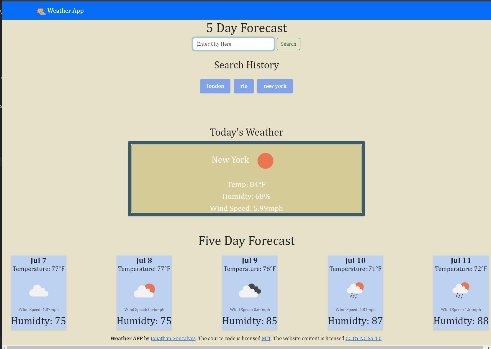

# Weather-Challenge- WebAPIs
[](https://opensource.org/licenses/MIT)


## MY Task

My task was to create a weather app using the Open Weather API. I had to get the current weather that would included the city name, the date, an icon representation of weather conditions, the temperature, the humidity, and the wind speed. 

and also output a 5-day forecast that displays the date, an icon representation of weather conditions, the temperature, the wind speed, and the humidity. 

## User Story

```
Corey Yates (tutor) was a massive help when i would get stuck with certain parts like trouble wiht the sbumit button in the form. She explained to me that while usually you do target the buttonEL in the Event lisnter, in this case,you have to target the form since the button is part of the form. 

I also began the fetches for each api listed below (what they are missing is the api key and lat and lon that i set to a var(s) )

https://api.openweathermap.org/geo/1.0/direct?q=
https://api.openweathermap.org/data/2.5/weather?lat=
https://api.openweathermap.org/data/2.5/forecast?lat=

I decided when tackling the selectors, to try the current weether task with jquery and the fiveDayForcast with vanilla javascript. 

it was nice to see how the code can be cleaned up much better with jquery. ill try to focus on it but also keep going back to vanilla so i dont get rusty. 


```


## Tested as of 7/6/2023

The Application was tested by the author on the above date

* It is displaying the GetWeather function properly in the browser

* it is also displaying the fiveDayForecast function in the browser

*Button for Previously search cities is working




- - -
© Jonathan Goncalves
